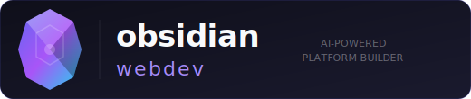
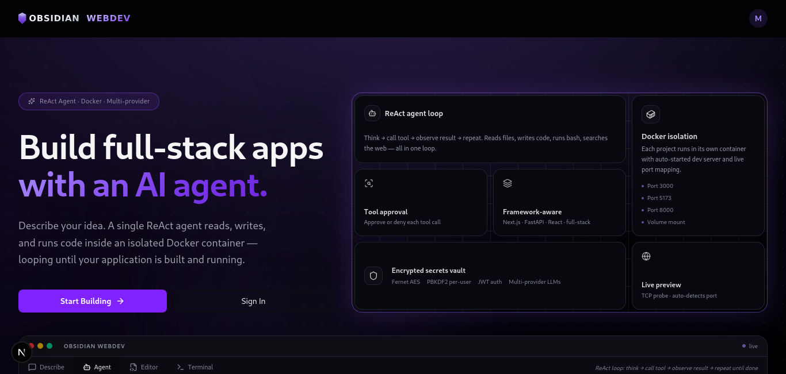

<div align="center">



### Open-Source AI-Powered Platform Builder

Describe what you want to build. A single ReAct agent plans it, writes the code, runs commands, and iterates — live, in Docker, in your browser. Supports OpenAI, Anthropic, Claude, Ollama, and any OpenAI-compatible local model.

[](LICENSE)
[](https://github.com/sup3rus3r/obsidian-webdev/stargazers)
[](https://github.com/sup3rus3r/obsidian-webdev/issues)
[](https://www.python.org/)
[](https://nextjs.org/)
[](https://fastapi.tiangolo.com/)
[](https://react.dev/)
[](https://tailwindcss.com/)
[](https://docker.com)
[](https://www.mongodb.com/)

---

**If you find this project useful, please consider giving it a star!** It helps others discover the project and motivates continued development.

[**Give it a Star**](https://github.com/sup3rus3r/obsidian-webdev) ⭐

</div>

---

## THIS PROJECT IS IN ACTIVE DEVELOPMENT AND OPEN TO CONTRIBUTIONS

---

---

## Table of Contents

- [Why Obsidian WebDev?](#why-obsidian-webdev)
- [Features](#features)
  - [Single ReAct Agent](#single-react-agent)
  - [Multi-Provider AI Support](#multi-provider-ai-support)
  - [Tool Set](#tool-set)
  - [Human-in-the-Loop (HITL)](#human-in-the-loop-hitl)
  - [Agent-Initiated Clarification](#agent-initiated-clarification)
  - [Parallel Tool Execution](#parallel-tool-execution)
  - [Automatic Context Management](#automatic-context-management)
  - [File Summarization](#file-summarization)
  - [Session Memory](#session-memory)
  - [Live Workspace](#live-workspace)
  - [Project Isolation via Docker](#project-isolation-via-docker)
  - [Project Templates](#project-templates)
  - [Secrets Vault](#secrets-vault)
  - [User Preferences](#user-preferences)
  - [Security & Authentication](#security--authentication)
- [Architecture](#architecture)
- [Quick Start](#quick-start)
  - [Prerequisites](#prerequisites)
  - [Installation](#installation)
  - [Docker Base Image](#docker-base-image)
  - [Running the App](#running-the-app)
  - [Environment Variables](#environment-variables)
- [Tech Stack](#tech-stack)
- [Project Structure](#project-structure)
- [Roadmap](#roadmap)
- [Contributing](#contributing)
- [License](#license)

---

## Why Obsidian WebDev?

Most AI coding tools are plugins that edit files in your local IDE. **Obsidian WebDev** goes further — it gives each project a completely isolated Docker container with a full Node.js and Python runtime, and a single autonomous agent that can write code, install packages, run build commands, fix errors, search the web, and iterate until the task is done.

- **No environment setup** — Every project runs in a fresh Docker container. Node 22, Python 3.12, uv, bun, git, and tmux are pre-installed. No conflicting versions, no polluted global state.
- **Truly autonomous** — The agent doesn't just autocomplete. It reads files, runs bash commands, inspects the output, fixes errors, and loops — just like a developer working in a terminal.
- **Full visibility** — Every tool call is shown inline in the chat. You see exactly which files the agent read, which commands it ran, and what they returned. Nothing happens behind the scenes.
- **You stay in control** — Destructive tool calls (writes, bash, installs) require your approval by default. Flip to "auto" mode when you trust the agent to run freely, or require approval for specific patterns always.
- **No vendor lock-in** — Switch between OpenAI, Anthropic, Ollama, and LM Studio per-project without changing any configuration. Your API keys are encrypted in the vault.
- **Self-hosted & open-source** — Run entirely on your own infrastructure. Your code and conversation history never leave your servers.

---

## Features

### Single ReAct Agent

Every project is powered by a single **ReAct** (Reason + Act) agent loop. On each turn the agent receives the full conversation history plus a system prompt containing the project name, framework, and build standards. It reasons, decides which tools to call, executes them in parallel, appends the results to history, and loops — up to 50 iterations — until the task is done or there are no more tool calls to make.

- **Reasoning before action** — The agent produces a text response explaining its thinking before every tool call. You see the reasoning streamed live in the chat before tools execute.
- **Streaming responses** — Text tokens are streamed token-by-token via WebSocket as the LLM generates them. Tool call events, results, and status changes are pushed as separate typed events.
- **Multi-turn context** — Conversation history is preserved in MongoDB and restored on reconnect. The agent remembers all prior work across browser refreshes and WebSocket reconnections.
- **Up to 50 iterations** — A configurable maximum loop count prevents runaway tasks. The agent signals `done` when it decides no further action is needed.
- **Stop at any time** — Send a `stop` message from the frontend. The agent's `asyncio.Event` is set, the current tool finishes (never cut mid-execution), and a `stopped` event is returned.

---

### Multi-Provider AI Support

Connect to any major LLM provider. Switch models per-project without changing any agent code. API keys are stored encrypted in the vault.

| Provider | Models | Type |
|----------|--------|------|
| **OpenAI** | GPT-4.1, GPT-4.1-mini, o4-mini | Cloud |
| **Anthropic** | Claude Opus 4.6, Claude Sonnet 4.6, Claude Haiku 4.5 | Cloud |
| **Ollama** | Any local model (Llama, Qwen, Mistral, DeepSeek…) | Local |
| **LM Studio** | Any local model via OpenAI-compatible endpoint | Local |

- **Unified streaming interface** — Anthropic and OpenAI use different streaming APIs (content blocks vs. delta chunks). The agent normalises both into the same internal event stream.
- **Reasoning model support** — OpenAI o-series models (o4-mini) are handled specially: `stream_options={"include_usage": True}` is passed to capture actual token counts from the streaming response.
- **Accurate token tracking** — Token counts come from the actual API response (`usage.input_tokens` for Anthropic, `usage.prompt_tokens` for OpenAI) rather than character estimates. This drives the context management thresholds precisely.
- **Model-aware context limits** — Each model has a known context window (200K for Claude, 1M for GPT-4.1, 8K default for local models). Pruning and compaction thresholds are calculated against the actual limit for each model.
- **Per-project model selection** — Set the provider and model when creating a project. Change it on any subsequent chat message without restarting the agent session.

---

### Tool Set

The agent has ten built-in tools. Each tool has a **permission tier** that controls when it requires human approval.

| Tool | Tier | Description |
|------|------|-------------|
| `read_file(path)` | auto | Read a file from the project workspace |
| `write_file(path, content)` | ask | Create or overwrite a file |
| `edit_file(path, old_string, new_string)` | ask | Surgically replace a unique string in a file |
| `bash(command)` | ask | Run a shell command inside the Docker container |
| `glob(pattern)` | auto | Find files matching a glob pattern |
| `grep(pattern, path)` | auto | Search file contents by regex |
| `web_fetch(url)` | auto | Fetch and strip a web page |
| `web_search(query)` | auto | Search the web (Tavily primary, DuckDuckGo fallback) |
| `list_files_brief()` | auto | List all project files with AI-generated one-line summaries |
| `ask_user(question)` | auto | Ask the user a clarification question and suspend until answered |

**Permission tiers explained:**

- `auto` — Executes immediately without user interaction. Used for read-only and non-destructive tools.
- `ask` — Requires explicit user approval when the session is in `ask` mode (the default). In `auto` mode, executes immediately.
- `always` — Always requires approval regardless of mode. Applied automatically to bash commands containing destructive patterns (`rm -rf`, `DROP TABLE`, `git push --force`, `mkfs.*`, etc.).

**Tool output limits** — All tool outputs are truncated to prevent context overflow. Bash output is truncated to the first + last N lines. File reads are similarly head+tail truncated. Web fetches are limited by character count. All limits are configurable via user preferences.

---

### Human-in-the-Loop (HITL)

The agent suspends before executing `ask`-tier tools and sends a `tool_approval_request` event to the frontend. A `ToolApprovalCard` appears inline in the chat with the tool name, full parameters, and Approve / Deny buttons. The agent's `asyncio.Future` is resolved when the user responds.

- **Inline approval cards** — Each approval request is rendered as an interactive card in the chat thread. The card shows the tool name, formatted parameters (collapsible), and Approve / Deny buttons.
- **Approved / denied state** — After the user responds, the card updates to a non-interactive read-only state showing the outcome (green for approved, red for denied).
- **Approve All** — A "Approve all" button sends `set_permission_mode: "auto"` and approves the current request in one click. All subsequent tool calls in the session run automatically.
- **Denied tool handling** — If the user denies a tool call, the agent receives a denial message as the tool result and can adapt its approach — try a different strategy, ask for clarification, or stop.
- **300-second timeout** — Approvals that receive no response within 5 minutes are automatically denied. The agent receives a timeout message and continues.
- **Permission mode persistence** — The `ask`/`auto` mode set by "Approve All" persists for the entire session. Sending a new chat message no longer resets it to the default.

---

### Agent-Initiated Clarification

The agent can pause mid-task to ask you a clarification question using the `ask_user` tool. The loop suspends, a `ClarificationCard` appears inline in the chat, and execution resumes the moment you submit an answer.

- **Suspend-and-resume** — The agent's `asyncio.Future` is held until the `clarification_response` WebSocket message arrives. No polling; zero CPU while waiting.
- **Inline question card** — The `ClarificationCard` shows the agent's question with a text input and a submit button. Press Enter or click the button to respond.
- **Answered state** — After submission, the card transitions to a read-only "Agent asked / your answer" view that persists in the conversation history.
- **Opt-in usage** — The agent is instructed to make reasonable assumptions and only use `ask_user` when genuinely blocked (e.g. "Should I use PostgreSQL or SQLite?" when neither is specified). It does not ask for things it can decide itself.
- **300-second timeout** — If no answer arrives within 5 minutes, the agent continues with a best-assumption response rather than hanging indefinitely.
- **Stop signal respected** — Pressing Stop while a clarification is pending immediately resolves the future with `"(agent stopped)"` and terminates the loop cleanly.

---

### Parallel Tool Execution

When the LLM decides to call multiple tools in a single turn, they execute concurrently via `asyncio.gather` rather than sequentially. Reading three files or running two grep searches happens in parallel, cutting multi-tool turns from O(n × tool_latency) to O(max(tool_latency)).

- **Full concurrency** — All tool calls in a single LLM response are dispatched simultaneously. The results are collected and appended to history in the original declaration order.
- **Pre-filled result map** — Before `asyncio.gather` is called, every `tool_use` ID is pre-filled with `"Interrupted."`. If a `CancelledError` fires mid-gather, every tool block already has a matching result, preventing Anthropic API 400 errors from mismatched tool_use/tool_result pairs.
- **Per-tool error isolation** — If one tool raises an exception, its result is set to the error message. Other tools in the same batch continue to completion unaffected.
- **HITL approval in parallel** — Multiple approval requests fire concurrently. The user sees all pending cards at once and can approve or deny them in any order.

---

### Automatic Context Management

Large codebases and long build sessions generate histories that exceed any model's context window. Obsidian WebDev uses a two-tier approach to keep the agent running without losing important context.

**Tier 1 — Lite prune (60% threshold):**

When the conversation history reaches 60% of the model's context limit, old tool results are truncated in-place to 500 characters. The tool calls, file writes, and agent reasoning are preserved; only the verbose output is shortened. The agent continues without interruption and without discarding any history.

**Tier 2 — Full compaction (80% threshold, configurable):**

When the history reaches 80% of the context limit, the agent triggers a full compaction:

1. A separate non-streaming LLM call (`_internal_llm_call`) summarises the conversation up to that point.
2. The history is replaced with a `[Conversation Summary]` block containing the summary, followed by the last 8 messages verbatim.
3. A `compacting` event is sent to the frontend, which renders a brief indicator in the chat.
4. The loop continues with the compressed history.

- **Accurate token counts** — Both thresholds are calculated against actual `usage.input_tokens` from the last API response, not character estimates. This prevents premature compaction on small models and late compaction on large ones.
- **Configurable thresholds** — The compaction trigger percentage is a per-user preference (Settings → Agent). Reduce it to compact more aggressively on small models; increase it to keep more history on large-context models.
- **Preserved recent context** — The last 8 messages are always kept verbatim after compaction, ensuring the agent retains the most recent instructions and file edits regardless of history length.

---

### File Summarization

After every `write_file` or `edit_file` call, a background task generates a one-line AI summary of the modified file and stores it in MongoDB. The `list_files_brief` tool returns all summaries for the project, giving the agent a map of the entire codebase in a single tool call.

- **Background generation** — Summaries are generated as `asyncio.create_task` (fire-and-forget). The agent loop is never blocked waiting for a summary to be written.
- **Persistent storage** — Summaries are stored in `ProjectFileSummaryCollection` keyed by `(project_id, path)`. They survive browser refreshes and agent session restarts.
- **Self-healing** — Files written before the feature was enabled don't have summaries. `list_files_brief` falls back gracefully for unsummarised files, showing just the path.
- **Codebase navigation** — On complex existing projects, the agent calls `list_files_brief` first to understand the structure before deciding which files to open in full. This reduces unnecessary `read_file` calls and keeps the context smaller.

---

### Session Memory

Conversation history is persisted to MongoDB and restored when the WebSocket reconnects. The agent picks up exactly where it left off — no context loss on browser refresh, no need to repeat yourself.

- **Full history persistence** — Both the LLM message history (for the agent) and the display message history (for the chat UI) are saved to `ProjectConversationCollection` after every message.
- **Reconnect restoration** — When a WebSocket connection is established, the server sends a `history` event with all saved display messages. The frontend rebuilds the chat UI instantly without any additional API calls.
- **Agent context restoration** — On the first chat message of a new session, the agent's message list is populated from MongoDB. The LLM receives the full prior context as if the conversation never ended.
- **Clear history** — A `clear_history` WebSocket message wipes both the LLM history and the display history for the project. Useful for starting a fresh task without creating a new project.

---

### Live Workspace

The workspace is a four-panel environment built around the project's Docker container.

- **Monaco editor** — Full VS Code editor with syntax highlighting, bracket matching, and auto-indent. The active file reloads automatically whenever the agent writes to it.
- **File tree** — Shows the live file system of the project workspace. Refreshes automatically on every `file_changed` WebSocket event from the agent. Files appear in the tree the moment the agent creates them — no manual refresh needed.
- **Integrated terminal** — A full xterm.js terminal connected to a bash session inside the Docker container. Run commands directly, inspect logs, or test the built app without leaving the browser.
- **Preview panel** — Embedded iframe that loads the app's dev server URL (port 3000 for Next.js/Vite, 8000 for FastAPI). Refresh the preview while the app is running to see your changes live.
- **Agent chat** — Full-height right panel with streaming chat, tool call cards, approval cards, clarification cards, file chips, compaction indicators, and a done state. The chat input supports Shift+Enter for newlines, file/image attachments (PDF, PNG, JPG, GIF, WebP, plain text, Markdown, JSON), and drag-and-drop paste of clipboard images.
- **Model picker** — A compact dropdown in the chat toolbar lets you switch model provider and model without leaving the workspace. The selection is persisted per-project to localStorage.

---

### Project Isolation via Docker

Every project runs in its own Docker container. The container's `/workspace` directory is bind-mounted to `backend/data/projects/{project_id}/` on the host, so file writes from the agent (via the host Python process) and file writes from bash commands (inside the container) both land in the same directory.

- **Pre-built base image** — `obsidian-webdev-base:latest` (Ubuntu 24.04) ships with Node.js 22, npm, bun, Python 3.12, uv, git, curl, and tmux. No internet access is required at container start time for any of these tools.
- **Three exposed ports** — Each container exposes ports 3000, 5173, and 8000. The workspace preview panel connects to whichever port the framework's dev server uses.
- **Automatic cleanup** — Containers idle beyond `CONTAINER_IDLE_TIMEOUT_MINUTES` (default: 60) are stopped automatically. Hard removal happens after `CONTAINER_HARD_REMOVE_HOURS` (default: 24).
- **Template injection** — When a new project is created with a non-blank framework, the container runs the framework's scaffold command (`npx create-next-app@latest`, `uv init`, etc.) as a background task. The workspace shows a "Preparing…" state until scaffolding completes.
- **Bind-mount sync** — MongoDB is the authoritative file store. `sync_from_volume()` scans the bind-mounted directory and upserts any files found, skipping `node_modules`, `.git`, `.next`, `.venv`, and `__pycache__`. This runs automatically if MongoDB is empty when the workspace loads.

---

### Project Templates

Choose a starting template when creating a project. The agent receives framework-specific context in its system prompt and the container is pre-scaffolded with the framework's standard boilerplate.

| Template | Scaffold command | Dev server port |
|----------|-----------------|-----------------|
| **Next.js** | `npx create-next-app@latest` | 3000 |
| **Vite + React** | `npm create vite@latest` | 5173 |
| **FastAPI** | `uv init` + `uv add fastapi uvicorn[standard]` | 8000 |
| **Express** | `npm init -y` + minimal `index.js` | 8000 |
| **Full-Stack** | `git clone https://github.com/sup3rus3r/nextapi.git` | 3000 + 8000 |
| **Blank** | No scaffold | — |

- **Framework context in system prompt** — The agent's system prompt includes the project name and framework. This guides the agent to use the right package manager, file conventions, and port numbers without being explicitly told.
- **Background scaffolding** — Template injection runs as an `asyncio.create_task` so the API response returns immediately. The project status transitions from `preparing` to `running` once scaffolding completes.
- **File sync before ready** — `sync_from_volume()` is called after scaffolding and before the status is set to `running`, ensuring the file tree is populated before the user can interact with the workspace.

---

### Secrets Vault

Store AI provider API keys in an encrypted vault. Keys are encrypted with AES-256 (Fernet) at rest — the raw value is never accessible after saving.

- **Per-provider keys** — One key per provider per user. Supported providers: Anthropic, OpenAI, Ollama, LM Studio, Obsidian AI (self-hosted).
- **Encrypted at rest** — All stored values are encrypted with a Fernet key derived from the user ID and a server-side master key. The encrypted blob is what's stored in MongoDB / SQLite.
- **Key validation** — A "Test" button on each key row calls the provider's API with a minimal request to verify the key is valid before running an agent.
- **Environment fallback** — If a user doesn't have a vault key for a provider, the backend falls back to the server-level environment variable (`ANTHROPIC_API_KEY`, `OPENAI_API_KEY`). This lets you pre-configure a shared key for multi-user setups.

---

### User Preferences

Per-user agent behaviour settings stored in MongoDB. Changes take effect on the next chat message — no restart required.

| Setting | Default | Range | Description |
|---------|---------|-------|-------------|
| **Permission mode** | Ask | Ask / Auto | Whether the agent requires approval before write/bash tools |
| **Compaction trigger** | 80% | 50–95% | % of context window at which history is compacted |
| **Bash output limit** | 400 lines | 50–2000 | Max lines of bash output kept in context |
| **File read limit** | 500 lines | 50–2000 | Max lines when reading a file |
| **Web fetch limit** | 20,000 chars | 5,000–100,000 | Max characters from a web page fetch |

Preferences are loaded from MongoDB on every chat message and forwarded to the `Agent` constructor. This means a preference change in Settings takes effect immediately without requiring a page reload or new session.

---

### Security & Authentication

- **JWT authentication** — All API endpoints and WebSocket connections are protected by JWT bearer tokens. WebSocket auth is passed as a `?token=` query parameter to avoid the browser WS API's lack of custom header support.
- **NextAuth v5** — The frontend uses NextAuth with a credentials provider. Access tokens are stored in the session and included in every API and WebSocket request.
- **AES end-to-end encryption** — Sensitive values (API keys) are additionally encrypted client-side before transmission using a shared `NEXT_PUBLIC_ENCRYPTION_KEY` / `ENCRYPTION_KEY` pair. The server receives and stores only the encrypted form.
- **Fernet secrets vault** — Server-side vault encryption uses Fernet (AES-128-CBC + HMAC-SHA256) with a master key + per-user key derivation. Raw key values are never returned by any API endpoint.
- **Role-based access control** — Users have a `guest` or `admin` role. Admin-only operations are protected by `require_role("admin")` on the backend.
- **Rate limiting** — `slowapi` enforces per-user and per-API-client rate limits on all routes.

---

## Architecture

```
Browser
  │  WebSocket  /ws/agent/{session_id}?token=...   (streaming events)
  │  REST API   /auth /projects /vault /settings   (CRUD + auth)
  ▼
FastAPI  (port 8100)
  ├── websocket/agent_ws.py        WS handler — receives chat, dispatches to runner
  ├── services/agent_runner.py     asyncio session registry — start/stop/approval/clarification
  ├── services/project_service.py  project CRUD + container lifecycle
  ├── services/container_service.py Docker SDK — run, exec, ports, cleanup
  └── agents/
      ├── agent.py    ReAct loop — LLM call → parallel tool dispatch → history → repeat
      └── tools.py    Tool definitions + permission tier registry

MongoDB (always) + SQLite/PostgreSQL (user auth)

Docker container (one per project)
  └── /workspace  ←──  bind-mount: backend/data/projects/{project_id}/
```

### Data flow for a single chat turn

```
1.  User sends {"type": "chat", "content": "Add a login page"}
2.  agent_ws.py loads user preferences from MongoDB
3.  agent_runner.start_agent() creates Agent + asyncio.Task
4.  Agent prepends user message to history
5.  Agent calls LLM (streaming) → tokens arrive as {"type": "token"} events
6.  LLM response contains 3 tool_calls → asyncio.gather fires all 3 concurrently
    ├── read_file("src/app/layout.tsx")     → returns file contents
    ├── glob("src/**/*.tsx")                → returns file list
    └── web_search("NextAuth login route")  → returns search results
7.  Tool results appended to history
8.  Agent calls LLM again → streams a plan, then calls write_file()
9.  write_file requires approval → {"type": "tool_approval_request"} sent
10. User clicks Approve → agent_runner.resolve_approval() sets Future
11. write_file executes → file written to bind-mount → {"type": "file_changed"} sent
12. Frontend file tree refreshes; Monaco reloads if file was open
13. Loop continues until no more tool calls → {"type": "done"} sent
```

---

## Quick Start

### Prerequisites

- Docker installed and running
  - Linux: `sudo usermod -aG docker $USER` then reboot
- Node.js 18 or later
- Python 3.12 or later
- [`uv`](https://docs.astral.sh/uv/) package manager
- MongoDB (local or Atlas)

### Installation

```bash
# Clone the repository
git clone https://github.com/sup3rus3r/obsidian-webdev.git
cd obsidian-webdev

# Install root dependencies (concurrently)
npm install

# Install frontend dependencies
cd frontend && npm install && cd ..

# Install backend dependencies
cd backend && uv sync && cd ..
```

### Docker Base Image

Build the base image once. All project containers are created from this image.

```bash
docker build -f backend/Dockerfile.base -t obsidian-webdev-base:latest backend/
```

The image includes: Ubuntu 24.04, Node.js 22, npm 10, bun 1.3, Python 3.12, uv, git, curl, tmux.

### Running the App

```bash
npm run dev
```

This starts both servers concurrently:

| Service | URL |
|---------|-----|
| Frontend | http://localhost:3000 |
| Backend API | http://localhost:8100 |
| API docs (Swagger) | http://localhost:8100/docs |

### Environment Variables

**Backend — `backend/.env`**

```bash
cp backend/.env.example backend/.env
```

| Variable | Required | Description |
|----------|----------|-------------|
| `DATABASE_TYPE` | Yes | `sqlite` or `mongo` |
| `SQLITE_URL` | If SQLite | e.g. `sqlite:///./obsidian.db` |
| `MONGO_URL` | Yes | MongoDB connection string |
| `MONGO_DB_NAME` | Yes | MongoDB database name |
| `JWT_SECRET_KEY` | Yes | Random secret for JWT signing |
| `JWT_ALGORITHM` | No | Default: `HS256` |
| `ENCRYPTION_KEY` | Yes | 32-byte hex key for AES encryption |
| `FERNET_MASTER_KEY` | Yes | Fernet key for vault encryption |
| `ANTHROPIC_API_KEY` | No | Fallback if user has no vault key |
| `OPENAI_API_KEY` | No | Fallback if user has no vault key |
| `OLLAMA_BASE_URL` | No | Default: `http://localhost:11434` |
| `LMSTUDIO_BASE_URL` | No | Default: `http://localhost:1234` |
| `TAVILY_API_KEY` | No | Web search — falls back to DuckDuckGo |
| `PROJECTS_DATA_DIR` | No | Default: `./data/projects` |
| `CORS_ORIGINS` | No | Comma-separated allowed origins |

Generate keys:

```bash
# JWT_SECRET_KEY, ENCRYPTION_KEY
openssl rand -hex 32

# FERNET_MASTER_KEY
python -c "from cryptography.fernet import Fernet; print(Fernet.generate_key().decode())"
```

**Frontend — `frontend/.env.local`**

```bash
cp frontend/.env.example frontend/.env.local
```

| Variable | Required | Description |
|----------|----------|-------------|
| `AUTH_SECRET` | Yes | NextAuth secret (use `openssl rand -hex 32`) |
| `NEXT_PUBLIC_API_URL` | No | Default: `http://localhost:8100` |
| `NEXT_PUBLIC_WS_URL` | No | Default: `ws://localhost:8100` |
| `NEXT_PUBLIC_ENCRYPTION_KEY` | Yes | Must match backend `ENCRYPTION_KEY` |

---

## Tech Stack

| Layer | Technology |
|-------|------------|
| **Frontend framework** | Next.js 16, React 19, TypeScript |
| **Frontend styling** | Tailwind CSS v4, shadcn/ui, Radix UI |
| **Authentication** | NextAuth v5 (credentials provider) |
| **Code editor** | Monaco Editor (VS Code engine) |
| **Terminal** | xterm.js |
| **Backend framework** | FastAPI 0.128+, Python 3.12 |
| **Async runtime** | asyncio, Motor (async MongoDB driver) |
| **SQL ORM** | SQLAlchemy (SQLite / PostgreSQL) |
| **Document DB** | MongoDB |
| **Agent** | Custom ReAct loop — no framework dependency |
| **LLM providers** | Anthropic SDK, OpenAI SDK |
| **Containers** | Docker SDK for Python |
| **Web search** | Tavily API, DuckDuckGo (fallback) |
| **Rate limiting** | slowapi |
| **Dev runner** | concurrently |

---

## Project Structure

```
obsidian-webdev/
│
├── package.json              # Root — `npm run dev` starts both servers
├── scripts/dev.sh            # Dev launcher with uvicorn reload config
│
├── backend/
│   ├── main.py               # FastAPI app + lifespan (DB init, cleanup task)
│   ├── config.py             # Pydantic settings — all env vars with defaults
│   ├── Dockerfile.base       # Base container image (Node 22, Python 3.12, uv, bun)
│   │
│   ├── agents/
│   │   ├── agent.py          # Single ReAct Agent — Anthropic + OpenAI + Ollama streaming
│   │   └── tools.py          # Tool definitions (TOOLS_ANTHROPIC, TOOLS_OPENAI) + TOOL_TIER
│   │
│   ├── services/
│   │   ├── agent_runner.py   # AgentSession dataclass + start/stop/approval/clarification
│   │   ├── project_service.py # Project CRUD + run_container + template injection
│   │   ├── container_service.py # Docker SDK — create/start/exec/cleanup + inject_template
│   │   └── file_service.py   # list/read/write + sync_from_volume + export_zip
│   │
│   ├── websocket/
│   │   ├── agent_ws.py       # Agent WebSocket endpoint — chat/stop/approval/clarification
│   │   ├── terminal_ws.py    # Container terminal WebSocket (xterm.js ↔ bash)
│   │   └── manager.py        # Connection registry
│   │
│   ├── routers/
│   │   ├── auth.py           # Register, login, profile, password, API clients
│   │   ├── projects.py       # Project CRUD + file endpoints + attachment parsing
│   │   ├── containers.py     # Container start/stop/status
│   │   ├── agent.py          # Agent session CRUD
│   │   ├── vault.py          # Secrets CRUD + validation
│   │   └── settings.py       # GET/PUT /settings/preferences
│   │
│   ├── models/
│   │   ├── sql_models.py     # SQLAlchemy: User, APIClient, UserSecret
│   │   └── mongo_models.py   # Motor: Project, File, Conversation, AgentSession,
│   │                         #        UserPreferences, FileSummary, Export
│   │
│   ├── core/
│   │   ├── security.py       # JWT encode/decode, get_current_user dependency
│   │   ├── vault.py          # Fernet encrypt/decrypt
│   │   └── rate_limiter.py   # slowapi limiter + user_limit helper
│   │
│   ├── database/
│   │   ├── mongo.py          # Motor client connect/disconnect/get_database
│   │   └── sql.py            # SQLAlchemy engine + SessionLocal + get_db
│   │
│   └── docs/
│       ├── ROADMAP.md                # Phase-by-phase feature roadmap
│       ├── AGENT_SYSTEM_PROMPT.md    # Agent system prompt (loaded at runtime)
│       └── AGENT_KNOWLEDGE_BASE.md  # Build standards and conventions
│
└── frontend/
    ├── package.json
    ├── next.config.ts             # API proxy rewrites
    ├── auth.ts                    # NextAuth v5 config
    │
    ├── app/
    │   ├── layout.tsx             # Root layout (Toaster, SessionProvider)
    │   ├── page.tsx               # Redirect → dashboard
    │   ├── auth/                  # Login + register pages
    │   └── dashboard/
    │       ├── page.tsx           # Project list + create modal
    │       ├── workspace/[id]/    # Main workspace (editor + chat + terminal + preview)
    │       ├── settings/          # API keys vault + agent preferences
    │       └── config/            # Profile + password
    │
    ├── components/
    │   ├── workspace/
    │   │   ├── agent-chat.tsx     # Chat panel — streaming, tools, approvals, clarifications
    │   │   ├── file-tree.tsx      # File browser sidebar
    │   │   ├── terminal.tsx       # xterm.js terminal
    │   │   └── preview.tsx        # App preview iframe
    │   └── ui/                    # shadcn/ui + Radix UI primitives
    │
    ├── lib/
    │   ├── api/
    │   │   ├── client.ts          # apiFetch + apiUrl + wsUrl helpers
    │   │   ├── ws.ts              # AgentWsClient class + useAgentWs hook
    │   │   ├── projects.ts        # Project + file API calls
    │   │   ├── agent.ts           # Agent session API calls
    │   │   ├── vault.ts           # Vault key API calls
    │   │   └── settings.ts        # Preferences API calls
    │   └── utils.ts               # cn() + misc utilities
    │
    └── types/
        └── api.ts                 # All shared TypeScript types (ServerEvent, ClientEvent,
                                   #   UserPreferences, Project, FileNode, AgentSession, …)
```

---

## Roadmap

See [docs/ROADMAP.md](docs/ROADMAP.md) for full detail and phase-by-phase breakdown.

### Foundation & Core Agent

- [x] **Docker base image** — Ubuntu 24.04 with Node.js 22, Python 3.12, uv, bun, git, tmux — one image, all frameworks
- [x] **Project templates** — Next.js, Vite + React, FastAPI, Express, Full-Stack (nextapi), Blank — scaffold via CLI on first run
- [x] **Single ReAct agent** — Custom asyncio agent loop; no framework dependency; supports Anthropic + OpenAI streaming and Ollama/LMStudio via OpenAI compat
- [x] **Full tool set** — `read_file`, `write_file`, `edit_file`, `bash`, `glob`, `grep`, `web_fetch`, `web_search`, `list_files_brief`, `ask_user`
- [x] **WebSocket streaming** — Typed event protocol; token streaming, tool call events, file change events, history replay on reconnect

### Human-in-the-Loop & Control

- [x] **Tool approval system** — Permission tiers (auto / ask / always); inline `ToolApprovalCard`; approve, deny, approve-all; 300s auto-deny timeout
- [x] **Agent-initiated clarification** — `ask_user` tool; `ClarificationCard` inline in chat; suspend-and-resume via `asyncio.Future`; answered state in history
- [x] **Permission mode persistence** — "Approve all" now survives to the next chat turn (session-level, not overwritten on each message)
- [x] **Stop signal** — Interrupts cleanly between tool calls; never cuts mid-execution; pending approvals and clarifications are resolved immediately

### Intelligence & Context

- [x] **Two-tier context management** — Lite prune at 60%, full compaction at 80%; accurate token counts from API response; configurable per user
- [x] **Parallel tool execution** — All tool calls in a turn execute via `asyncio.gather`; pre-filled result map prevents API 400 on cancellation
- [x] **File summarization** — Background AI summaries stored per file in MongoDB; `list_files_brief` gives the agent a codebase map in one call
- [x] **Session memory** — Full conversation history persisted to MongoDB; restored on reconnect for both the LLM and the chat UI

### Workspace & UX

- [x] **Live workspace** — Monaco editor, file tree, xterm.js terminal, app preview iframe — all in one panel layout
- [x] **Live file sync** — File tree updates on every `file_changed` event; Monaco reloads if the file is open; no manual refresh needed
- [x] **Preparing state** — "Preparing workspace…" shown while template scaffolding runs; chat and editor disabled until container is ready
- [x] **User preferences** — Per-user agent settings (permission mode, compaction %, output limits) stored in MongoDB; applied per chat message

### Security & Auth

- [x] **JWT + NextAuth v5** — Token-based auth on all endpoints and WebSocket connections
- [x] **AES + Fernet vault** — Client-side AES encryption + server-side Fernet storage; raw key values never returned by any endpoint
- [x] **RBAC + rate limiting** — Guest / admin roles; slowapi rate limits per user

### Planned

- [ ] Django (`django-admin startproject`, port 8000)
- [ ] SvelteKit (`npm create svelte@latest`, port 5173)
- [ ] Vanilla HTML/CSS/JS (static server, port 8080)
- [ ] Astro (`npm create astro@latest`, port 4321)
- [ ] Flutter (`flutter create`, if mobile toolchain added to base image)

---

## Contributing

Contributions are welcome. Whether it's bug reports, feature suggestions, or pull requests — all input is valued.

### How to Contribute

1. **Fork the repository**

   Click the [Fork](https://github.com/sup3rus3r/obsidian-webdev/fork) button at the top right of this page.

2. **Clone your fork**

   ```bash
   git clone https://github.com/your-username/obsidian-webdev.git
   cd obsidian-webdev
   ```

3. **Create a feature branch**

   ```bash
   git checkout -b feature/your-feature-name
   ```

4. **Build the Docker base image** (required to run the app)

   ```bash
   docker build -f backend/Dockerfile.base -t obsidian-webdev-base:latest backend/
   ```

5. **Make your changes and commit**

   ```bash
   git commit -m "Add your feature description"
   ```

6. **Push and open a Pull Request**

   ```bash
   git push origin feature/your-feature-name
   ```

   Open a pull request against the `main` branch with a clear description of your changes and what problem they solve.

### Reporting Issues

Found a bug or have a feature request? [Open an issue](https://github.com/sup3rus3r/obsidian-webdev/issues) with as much detail as possible — steps to reproduce, expected vs. actual behaviour, and your environment (OS, Docker version, browser).

---

## License

This project is licensed under the **GNU Affero General Public License v3.0 (AGPL-3.0)**.

- **Free to use** — Use, study, and modify for any purpose.
- **Copyleft** — If you distribute this software or run it as a network service, you must make the complete source code available under the same AGPL-3.0 terms.
- **No additional restrictions** — You cannot impose further restrictions on recipients' exercise of the rights granted by this license.

See the [LICENSE](LICENSE) file for the full terms.
